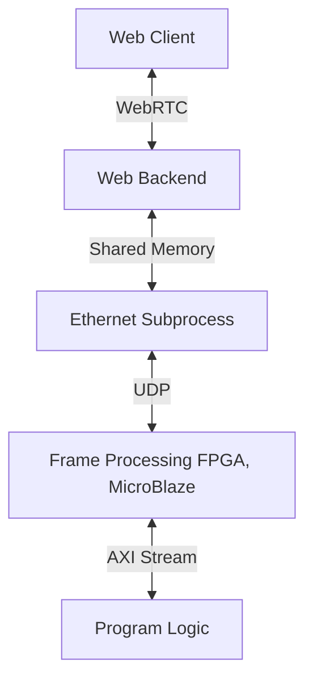
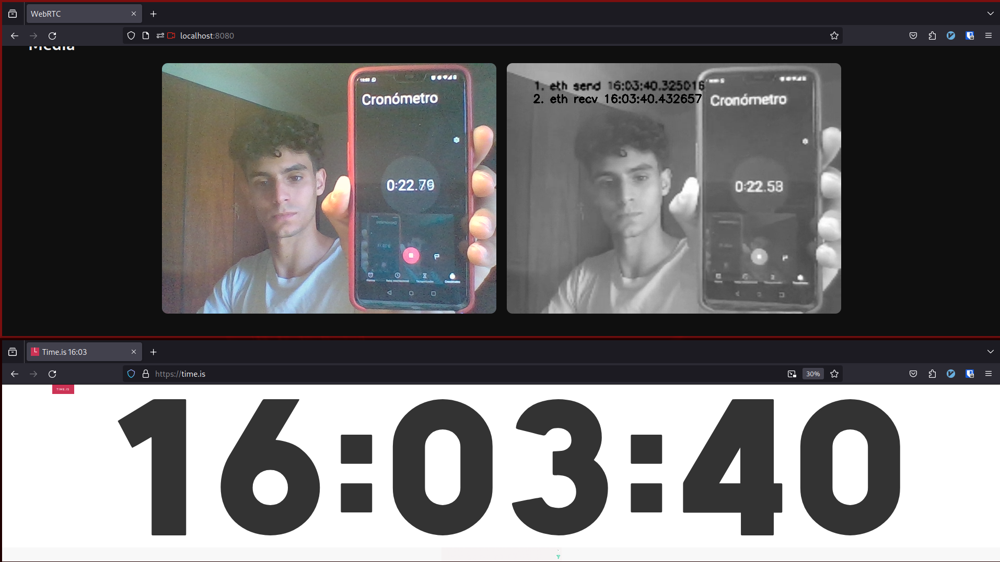

# Real Time Video Processing Web Server

## Description

This project implements a web server with python and uses webRTC to establish a real time communication with the client. The frontend captures video and streams it to the backend, where it is sent to a video processing server where it is filtered using different kernels. Then the server sends back the processed frame.

- [FPGA Sources](https://github.com/marcosraimondi1/procom/tree/tpfinal_program_logic)

## Architecture



This project is part of an FPGA project, the FPGA will take part as the frame processing server.

## Latency Screenshots



Several measurements where taken in different scenarios. Mainly if the processing server was in the same network or in a remote network. And if it was either via TCP or UDP protocol, proving that UDP is more suitable for streaming applications.

## Requirements

- python 3 or higher
- linux environment

## Build

1. Create a virtual environment:

```bash
python -m venv venv
source venv/bin/activate
```

2. Install required dependencies from server/backend/requirements.txt:

```bash
pip install -r requirements.txt
```

3. Run webserver:

```bash
python server.py
```

4. Run frame processing server:

```bash
python eth_server.py
```

5. The web application should be accesible through localhost:8080

## Configurations

Most configurations can be done from the globals.py file in the backend/modules directory.

Frequent Configurations:
- HOST: ip of the frame processing server, '0.0.0.0' for localhost
- PORT: port where the frame processing server is listening
- CUT_SIZE: size to keep from the original size of the video
- ETH_RESOLUTION: resolution to be sent to the frame processing server. This has an impact on the frame processing performance. Also the total size of the frame needs to be smaller than the max size of udp datagram (64kB).
